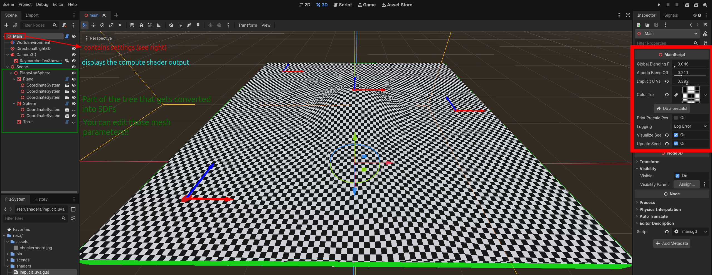
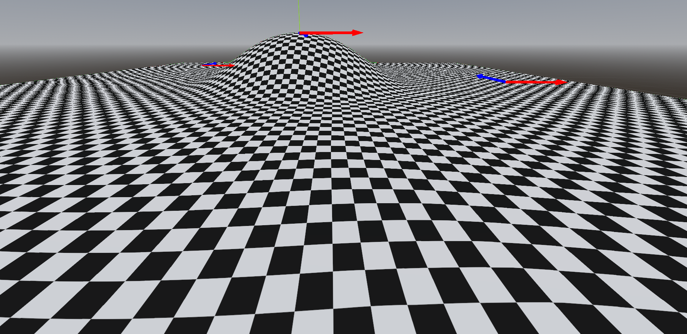

# ImplicitUVsImplementation
A Godot implementation of the paper "Implicit UVs: Real-time semi-global parameterization of implicit surfaces"[^1].

## For a **standalone C++ implementation** (without Godot), that runs on the web, see: [https://github.com/baptiste-genest/ImplicitUVs](https://github.com/baptiste-genest/ImplicitUVs)

The paper describes a way to texture signed distance functions **in realtime** by letting the user place so called **seeds** on the surface. Those seeds each define a local UV space around them (given by two basis vectors) and "the algorithm" will try to create a global UV field out of those seeds. For that, you need to select which seeds need to be merged together (using the `MergingGraph`).

This implementation uses sphere tracing to render the signed distance functions. Also converts the Godot scene tree into signed distance functions, so you can **use the normal Godot 3D viewport to create your SDF scene**.

[^1]: https://doi.org/10.1111/cgf.70056

> [!NOTE]
> I am not one of the authors. All credit goes to them.

https://github.com/user-attachments/assets/56025b03-3b57-4c2f-8081-121120168573

## How it works

The project has some CPU side code (shader setup, building the scene, linear solver) and some GPU code (mainly a raymarcher which uses my scene representation and runs the algorithms from the paper).
The GPU code is implemented as compute shader.

I tried to make everything as flexible as possible. If something doesn't look right, first try using `Scene - Reload saved scene`.

### Project structure
- `assets`: textures
- `bin`: binaries for the C++ GDExtension
- `gdextension`: Source code for the C++ linear system solver
- `scenes`: Just a helper scene for showing a coordinate system
- `shaders`: GLSL shaders for the raymarcher (`sdf.glsl`) and the algorithms from the paper (`implicit_uvs.glsl`)

### Details
#### CPU side
##### GDScript
The main GDScript code is inside of [main.gd](main.gd). It does the following things:
- Encodes a part of the Godot scene tree into a representation that can be passed into the compute shader (`Array[Transform3D]` which then gets converted into an array of `mat4`)
- While analysing the scene, collects all the relevant mesh parameters (like radius, size, ...) of all nodes which are of type `SDFMesh` (a custom helper class) to be turned into **signed distance functions** in the compute shader
- For each `SDFMesh`, also uses the mesh parameters to place **seeds** on the surface of those meshes and merge them together using the `MergingGraph` class
- Handles the creation and updating of all buffers, uniforms, pipelines etc. neccessary for executing the compute shader using the `RenderingDevice`
- After calling the compute shader, reads back some uniforms to pass the data into GDExtension module, which then outputs the results of the linear system optimization. This GDScript script then writes those values back into uniforms so that the next drawing can use them

> [!IMPORTANT]
> Right now, only the following Godot mesh types are supported (but it should be easy to extend):
> - `SphereMesh`
> - `BoxMesh`
> - `CylinderMesh`
> - `TorusMesh`

##### C++
The C++ is a simple GDExtension which uses the [Eigen](https://libeigen.gitlab.io/) library for solving two linear SPD (symmetric positive definite) systems.

It exposes two functions to be called from GDScript: `optimize_frames` and `optimize_offsets`. Both of them use the Eigen library to set up a linear system to solve equation 45 and equation 47 respectively.

Those functions compute the optimal values for the reference frames ("coordinate system" for each seed) and the offsets (offset in the global UV space for each seed).

If you want to modify the C++ code, you can use the helper scripts `BUILD_GDEXTENSION.sh` and `BUILD_GDEXTENSION_DBG.sh` to build the GDExtension part. Allthough I would recommend to just grab the scons command from them and adjusting it for your platform.

Also make sure to properly initialize the `godot-cpp` submodule.

#### GPU side
The GPU side consists of a classic sphere tracer inside of `shaders/sdf.glsl` which reads the scene representation created on the CPU select the appropriate SDF for each mesh on the CPU. That way you basically have a 1:1 conversion from the Godot scene to a collection of SDFs, which allows for very easy editing and composing of the SDF scene by just modifying the Godot nodes.

The actual code for the paper is inside of `shaders/implicit_uvs.glsl`. Namely, Algorithm 1 from the paper is called `compute_logmap` and algorithm 2 from the paper is called `compute_blended_uvs`.

Also includes some code to perform a "precalculation". There, some values need to be computed before the actual drawing can begin. Those values are written back into a SSBO and then read back on the CPU to be passed into the C++ solver.

> [!TIP]
> The shader code contains lots of comments, so it should be relatively easy to follow what it does and how it relates to the paper.

## Acknowledgements ♥️
Thank you **very much** to [Baptiste Genest](https://github.com/baptiste-genest), one of the original authors, for helping me find some issues with my initial implementation!
